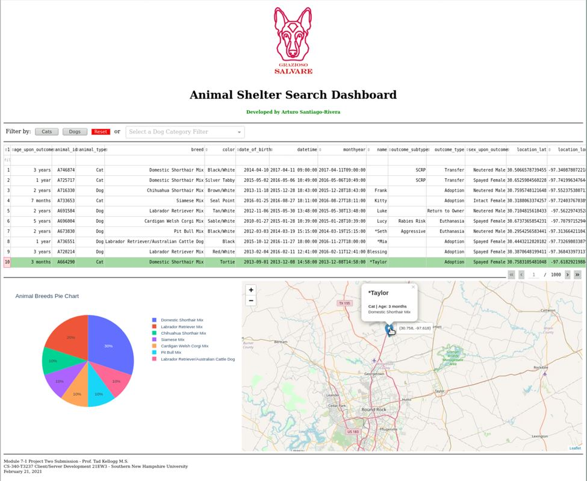

# Salvare Search for Rescue Web Application

---

---

     

## Overview

I have to design and develop a web application that works with existing databases from animal shelters to identify and categorize available dogs to train for different types of rescue, such as water rescue, mountain or wilderness rescue, locating humans after a disaster, or finding a specific human by tracking their scent. The application helps interact with and visualize individual dog profiles to train from a MongoDB database.

Through a user-friendly, intuitive client-facing web application dashboard, the user reduces errors and training time. The software design pattern used for this multi-tier application is the Model View Controller (MVC). Additionally, a RESTful protocol extends the HTTP protocol to give an application programming interface (API).

    
    
<em>Figure 1 - Salvare Search Web App Client/Database Dashboard Screenshot</em>

In this artifact, I employ industry-standard Python code best practices and techniques such as in-line comments, appropriate naming conventions, and formatting in conformance with proper coding standards, making the code easy to read and enhancing the application code organization. The program code is easy to read and follows formatting best practices defined by the industry, such as indentation in conformance with appropriate coding standards.

The source code is well-structured, consistent in style, and consistently properly formatted, including line breaks. We utilize appropriate syntax and conventions in terms of their best practice and use in programming. The implemented data structures are programmatic, where the stored variable values can be used efficiently in other methods. Method names are verbs as they represent actions being performed on something. All cases are covered in an IF-ELIF block, including ELSE or DEFAULT clauses.

This web application demonstrates our competencies to apply database systems concepts using a non-relational database like MongoDB and principles in developing a client/server application based on Python programming language, libraries, and framework. Demonstrates our understanding to develop client-side code that interfaces with databases.

**For a detailed description, function, and screen examples, please read the [Word Document](CS340-M7-2_Paper.pdf) paper.**

## Reflection

In this artifact, I employed strategies for building collaborative environments that enable diverse audiences to support organizational decision-making in computer science by designing and developing a multi-tier application with a Model View Controller (MVC) and RESTful protocol design to extend the HTTP protocol to provide an application programming interface (API). The most attractive concept of the MVC pattern is a separation of concerns.

I demonstrated my ability to use well-founded and innovative techniques, skills, and tools in computing practices to implement computer solutions that deliver value and accomplish industry-specific goals through a programmatic data structure, where the stored variable values can be used efficiently in different functions and callbacks through the web application. With this designed approach, I evaluated computing solutions that solve a problem using algorithmic principles and computer science practices and standards appropriate to the web application while managing the trade-offs involved in design choices.

These artifact enhancements were approached with a security mindset that anticipates adversarial exploits in software architecture and designs to expose potential vulnerabilities, mitigate design flaws, and ensure privacy and enhanced data security and resources by implementing engineering practices for validating input data and architect and design with default denial.

---

  

---

